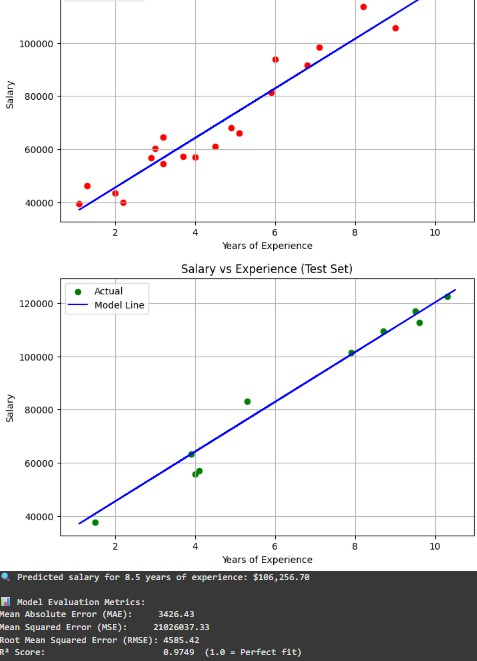

# 🎯 Salary Predictor App with Linear Regression
Explore and learn the magic of Supervised Learning through hands-on examples! This project features a Salary prediction app using Python's `scikit-learn` and helps you understand `Linear Regression` with training, testing, and evaluation.

---

## 📋 Features
- 📈 Predict salary based on years of experience.
- 🧠 Train a Linear Regression model using `scikit-learn`.
- 📊 Evaluate using MAE, MSE, RMSE, R².
- 📂 Modular project structure for educational and production use.

---

## 🗂 Project Structure

```
salary-predictor/
├── data/
│   └── Salary_Data.csv                # Dataset (Years of Experience vs Salary)
├── notebooks/
│   └── Salary_Prediction_Tutorial.py  # Full tutorial code
├── src/
│   └── (future) train_model.py, predict.py
├── app/
│   └── (future) Streamlit app.py
├── images/
│   ├── training_plot.png
│   ├── test_plot.png
│   └── evaluation_metrics.png
├── README.md
```

---

## 🚀 Getting Started

### Prerequisites
- 🐍 Python 3.x
- 💻 Jupyter Notebook installed (`pip install notebook`)
- 📦 Required packages:
```bash
pip install numpy pandas matplotlib scikit-learn
```
---

## ▶️ How to Run This Project in Google Colab

1. Open [Google Colab](https://colab.research.google.com/)
2. Click **File → Upload Notebook**, then select `Salary_Prediction_Tutorial.py` or `.ipynb`
3. In the first code cell, upload the CSV:
```python
from google.colab import files
uploaded = files.upload()
---

## ▶️ How to Run This Project in Jupyter Notebook

1. Clone this repository:
```bash
git clone https://github.com/dineshabey/ML-Linear-Regression-salary-predictor.git
cd ML-Linear-Regression-salary-predictor
```

2. Launch Jupyter Notebook:
```bash
jupyter notebook
```

3. Open `notebooks/Salary_Prediction_Tutorial.py` or convert it to `.ipynb` if needed.

4. Make sure `data/Salary_Data.csv` is in the correct path.

5. Run the cells step-by-step and see:
   - 📈 Visualizations
   - 🧠 Model training
   - 📊 Evaluation output

---

## 🛠 How to Use

### 🔢 Train & Predict

```python
from sklearn.linear_model import LinearRegression

regressor = LinearRegression()
regressor.fit(X_train, y_train)

y_pred = regressor.predict(X_test)
```

### 📊 Evaluate Accuracy

```python
from sklearn.metrics import mean_absolute_error, r2_score

print("MAE:", mean_absolute_error(y_test, y_pred))
print("R² Score:", r2_score(y_test, y_pred))
```

### 📉 Visualize Results

```python
plt.scatter(X_test, y_test, color='green')
plt.plot(X_train, regressor.predict(X_train), color='blue')
plt.title('Salary vs Experience')
plt.xlabel('Years')
plt.ylabel('Salary')
plt.show()
```

---

## 🌟 Why Linear Regression?

- 🔍 Ideal for understanding relationships in numerical data.
- 🧠 Forms the foundation for more advanced regression models.
- 📊 Easy to implement and visualize.

---

## 🖼️ Screenshots

### 📈 Training | Test Set ! Evaluation Metrics,Visualization



---

## 🤝 Contributing

We welcome contributions! Follow these steps to contribute:

1. Fork the repository.
2. Create a new branch:
```bash
git checkout -b feature-name
```
3. Make changes and commit:
```bash
git commit -m "Add new feature"
```
4. Push your branch:
```bash
git push origin feature-name
```
5. Open a Pull Request.

---

## 📧 Contact

👋 Hi, I'm Dinesh Abeysinghe

⚡ Got questions or feedback? Feel free to reach out!  
💻 Need software developed? Feel free to contact me to bring your ideas to life!

<div align="center">
<a href="https://www.linkedin.com/in/dinesh-abeysinghe-bb773293" target="_blank">
    
</a>

<!-- <a href="mailto:dinabeysinge@gmail.com" target="_blank">
    
</a> -->

<a href="https://huggingface.co/dineshabeysinghe" target="_blank">
    
</a>

<a href="https://www.linkedin.com/newsletters/7205635660026703872/" target="_blank">
    
</a>
</div>

---

This README provides a complete overview of the project with code examples, screenshots, and contribution guidelines.  
Enjoy building with Python ML! 🎉
